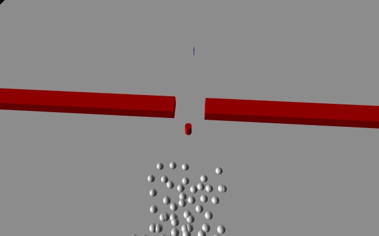
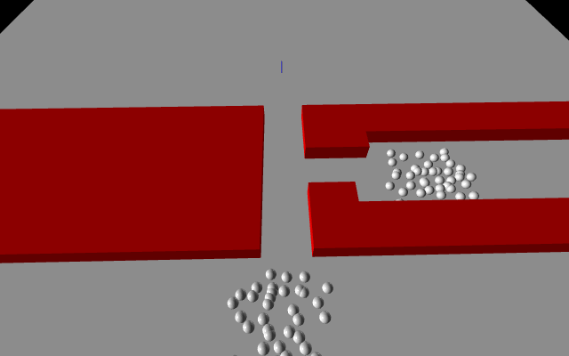

# Pedestrian_Sim
A pedestrian simulation made in Jupyter Notebook using Visual Python. A gradient descent is used with a cost function to simulate pedestrian movement.

## Cost Function
The cost function is made up of four separate functions. 
The first is the base cost function, which is simply the distance between the pedestrian and the goal. 
The second and third is the cost from cylinder obstacles and pedestrians, which is ln(R/d) when 0 < d <= R where R is a given radius and d is the distance between the pedestrian and obstacle.
The fourth function is the cost from box obstacles. The box cost function finds the point on the box closest to the pedestrian and uses it as the origin for a temporary cylidner obstacle.

## Simulation 1
The first simulation has pedestrians go through a door with an obstacle in the way.

## Simulation 2
The second simulation has pedestrians merge into a T-intersection.

## Future Improvements
Here are some future improvements I will do if I ever come back to this project.
- Update pedestrian cost function so that pedestrians can move to the side or behind another pedestrian.
- Update box cost function so that pedestrains are not pushed through the box by other pedestrians.
- Update overal cost function so that pedestrians are less likely to get stuck at local minimums.
- Stop pedestrians from moving if they reach a local/global minimum. 
